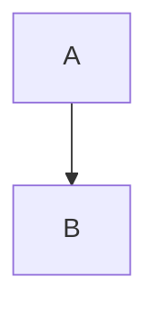

<!-- .slide: data-background="linear-gradient(to bottom, #67c4f7ff, #ffffffff)" data-transition="fade"-->
# Stern - Gerlach experiment

Rajarshi Tiwari


---

<!-- .slide: data-transition="zoom"-->
## Slide 1: Linear Algebra
- Vector independence <!-- .element: class="fragment"-->
- Span and dimension <!-- .element: class="fragment"-->
- Equation: $a \mathbf{v}_1 + b \mathbf{v}_2 = 0$ <!-- .element: class="fragment"-->

$$
\sqrt{\pi} = \int_{-\infty}^{\infty} e^{-x^2} dx
$$
<!-- .element: class="fragment"-->

$$
\sqrt{\pi} = \int_{-\infty}^{\infty} e^{-x^2} dx
$$
<!-- .element: class="fragment"-->

---

## Columns

<div style="display: flex; gap 20px;">
<div style="flex: 1;">

**Left column**

- Point A
- Point B

</div>
<div style="flex: 1;">

**Right column**
$$
H = \sum_{ij} t_{ij} c_i^\dagger c_j + \text{h.c.}
$$
</div>
</div>

---

## Slide 2: Quantum Mechanics
Hilbert space grows as $2^n$ with number of qubits $n$.

---

## Slide 3: Greek Letters
$\alpha x^2 + \beta y^2 = \gamma z^2$

---

<!-- .two-column -->
## Slide 4: Code Highlighting

```python [1-2|4]
def quantum_state(n):
    # wavefunction
    return f"Ψ_{n}"

print(quantum_state(1))
```

---

- 👉 Each `---` = new slide.

- 👉 Each `--` = vertical sub-slide under same topic.
  - Think of it as **2D** navigation through slides.

- 👉 Inline LaTeX with `$...$` and block math with `$$...$$`.

---

# Example with CSS columns

<div class="cols">
  <div class="col">
    <h3>Left</h3>
    <ul>
      <li>Point A</li>
      <li>Point B</li>
    </ul>
  </div>
  <div class="col">
    <h3>Right</h3>
    <p>Diagram:</p>
    
  </div>
</div>

---


---

# Thank you!